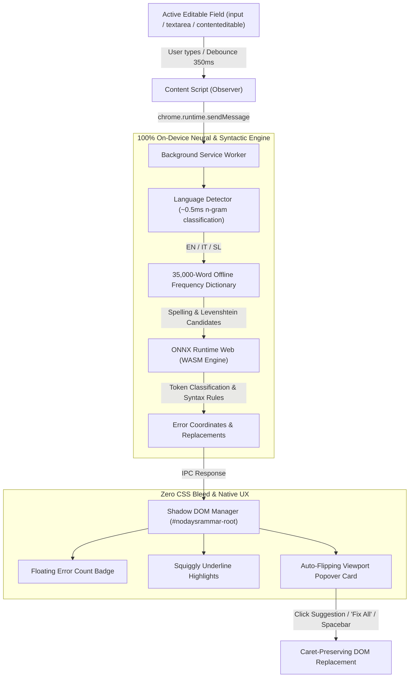

<p align="center">
  
</p>

<h1 align="center">nodaysrammar</h1>

<p align="center">
  <strong>On-device, zero-telemetry multilingual grammar and spell checker for Chromium.</strong><br>
  Local neural syntax classification via ONNX Runtime Web WASM and 35,000-word offline frequency dictionaries. Your keystrokes never leave your browser.
</p>

<p align="center">
  
  
  
  
  
  
</p>

<p align="center">
  <a href="https://github.com/nodaysidle/nodaysrammar/releases"><strong>Releases</strong></a>
  ·
  <a href="USERGUIDE.md"><strong>User Guide</strong></a>
  ·
  <a href="codemap.md"><strong>Architecture Map</strong></a>
  ·
  <a href="#quick-start"><strong>Quick Start</strong></a>
</p>

---

> **The Problem:** Cloud-based writing assistants (Grammarly, LanguageTool Cloud, remote AI extensions) transmit private keystrokes, personal notes, and credentials to third-party servers, creating security risks, latency overhead, and tracking vectors.
>
> **The Result:** **nodaysrammar** runs 100% locally. Lightweight ONNX neural models and 35,000-word offline frequency dictionaries execute in the Chromium background service worker via WebAssembly. Keystrokes never touch the network. Highlighting and suggestion cards render inside an isolated, non-colliding Shadow DOM overlay.

---

## ⚡ Architecture Flow



---

## ✨ Features

- **Zero Telemetry & 100% Private**: No analytics, no logging, no external API endpoints. Disconnect from Wi-Fi and the extension continues functioning at full speed.
- **Multilingual Support**:
  - 🇬🇧 **English (`en`)**: Subject-verb agreement, indefinite article selection (`a` vs `an`), homophone disambiguation (`there`/`their`/`they're`, `its`/`it's`), double negatives.
  - 🇮🇹 **Italian (`it`)**: Mandatory accents (`perché`, `è`), apostrophe and elision handling (`un'` vs `un`, `qual è`), contraction grammar.
  - 🇸🇮 **Slovenian (`sl`)**: Preposition phonetics (`s` before unvoiced consonants vs `z`; `k` vs `h`), subordinate conjunction commas (`ki`, `ko`, `ker`, `da`, `če`), diacritics.
- **Isolated Shadow DOM**: Injected via closed Shadow DOM to guarantee that page styles never break extension badges or suggestion cards, and extension styles never bleed into the host page.
- **Viewport-Aware Popover**: Suggestion cards auto-flip position between bottom and top based on element proximity to viewport boundaries.
- **Safe Text Replacement**: Dispatches synthetic `input` and `change` events with `execCommand('insertText')` to retain native browser undo history (`Ctrl+Z`).
- **Ergonomic Workflows**:
  - Click any underline to inspect suggestions.
  - Click floating badge to view all errors.
  - Click **"Fix All"** to apply all suggestions instantly.
  - Optional **"Auto-Fix on Spacebar"** mode.

---

## 📸 Interface Preview

| Feature | Screenshot |
| --- | --- |
| **Interactive Underlines & Errors** |  |
| **Auto-Flip Suggestion Card** |  |
| **Instant Correction Applied** |  |
| **All Fixed State** |  |
| **Options & Settings Page** |  |
| **Interactive Onboarding Tour** |  |

---

## 🚀 Quick Start

### 1. Installation

1. Clone this repository:
   ```bash
   git clone https://github.com/nodaysidle/nodaysrammar.git
   cd nodaysrammar
   ```
2. Open your Chromium-based browser (Chrome, Brave, Edge, Arc, Chromium).
3. Navigate to `chrome://extensions`.
4. Turn on **Developer mode** (toggle in upper right corner).
5. Click **Load unpacked** and select the `nodaysrammar` folder.
6. The extension is now active on all websites!

### 2. Testing Live

Run the comprehensive automated Puppeteer test suite against Brave / Chromium:

```bash
npm install
npm test
```

To test spacebar auto-fix and "Fix All" workflows:

```bash
npm run test:autofix
```

---

## 🧠 Neural Models & Offline Weights

nodaysrammar bundles lightweight ONNX neural models trained with opset 17 alongside 35,000-word offline frequency dictionaries:

| Model | File | Format | Target Rules |
| --- | --- | --- | --- |
| **English** | `models/en-grammar.onnx` | ONNX opset 17 (31 KB) | Agreement, articles, homophones, orthography |
| **Italian** | `models/it-grammar.onnx` | ONNX opset 17 (25 KB) | Mandatory accents, elision, contractions |
| **Slovenian** | `models/sl-grammar.onnx` | ONNX opset 17 (24 KB) | Preposition phonetics (s/z, k/h), conjunction commas |
| **Dictionaries** | `models/dict-*.json` | JSON (~570 KB each) | 35k-word frequency lists + Levenshtein ranking |

To regenerate or retrain models from scratch:

```bash
python3 scripts/generate_real_models.py
```

---

## 📁 Repository Reference

- [`USERGUIDE.md`](USERGUIDE.md) — Comprehensive user, technical, and troubleshooting documentation
- [`codemap.md`](codemap.md) — Complete codebase index and architectural structure
- [`AGENTS.md`](AGENTS.md) — System invariants, IPC contracts, and agent guidelines
- [`docs/RELEASE-NOTES-v1.0.0.md`](docs/RELEASE-NOTES-v1.0.0.md) — Release notes and checksums

---

## 📄 License

[MIT License](LICENSE) © 2026 [nodaysidle](https://github.com/nodaysidle)
