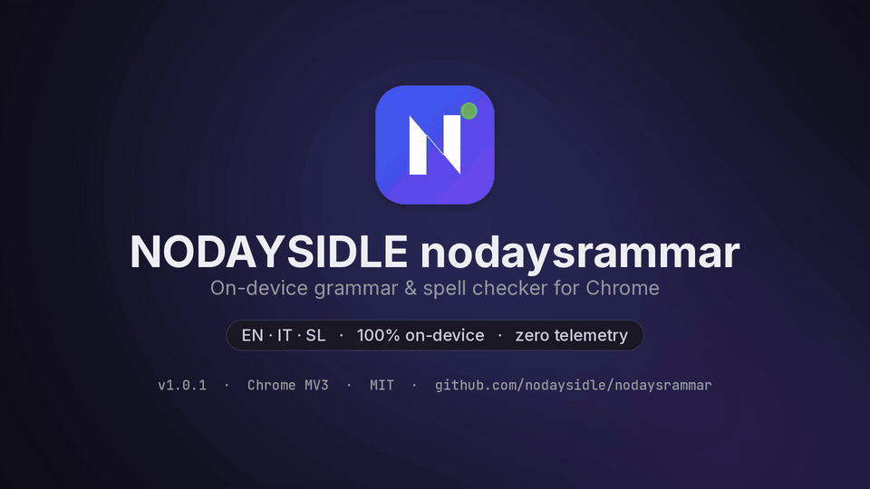
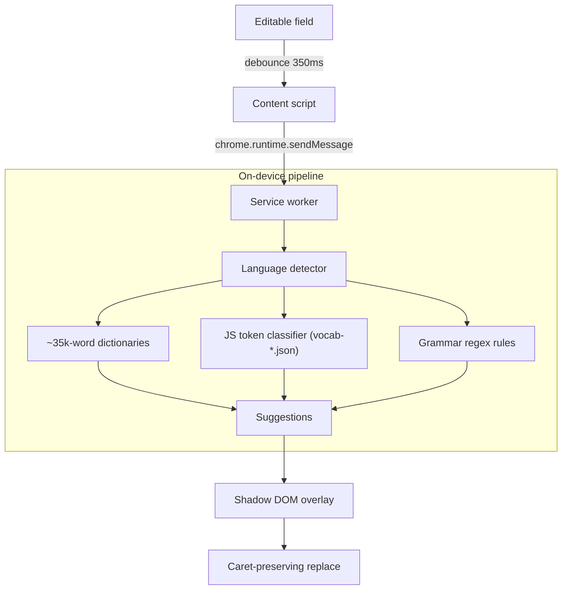

<p align="center">
  
</p>

<h1 align="center">NODAYSIDLE nodaysrammar</h1>

<p align="center">
  <strong>On-device, zero-telemetry multilingual grammar and spell checker for Chromium.</strong><br>
  A small JS classifier, ~35,000-word offline dictionaries, and grammar rules — your keystrokes never leave the browser.
</p>

<p align="center">
  
  
  
  
  
  
</p>

<p align="center">
  
</p>

<p align="center">
  <a href="https://github.com/nodaysidle/nodaysrammar/releases"><strong>Download Releases</strong></a>
  ·
  <a href="USERGUIDE.md"><strong>User Guide</strong></a>
  ·
  <a href="codemap.md"><strong>Architecture Map</strong></a>
</p>

<p align="center">
  <a href="#why">Why</a> ·
  <a href="#features">Features</a> ·
  <a href="#privacy">Privacy</a> ·
  <a href="#install">Install</a> ·
  <a href="#usage">Usage</a> ·
  <a href="#architecture">Architecture</a> ·
  <a href="#development">Development</a> ·
  <a href="#license">License</a>
</p>

---

## Why

Cloud writing assistants send drafts and keystrokes to remote servers. **NODAYSIDLE nodaysrammar** keeps every check inside your browser process: a small JS token classifier over fixed label tables, ~35k-word frequency dictionaries, and deterministic grammar rules for English, Italian, and Slovenian.

It is **not** listed on the Chrome Web Store. Install from [GitHub Releases](https://github.com/nodaysidle/nodaysrammar/releases) (or build from source) via Load unpacked.

---

## Features

- **100% on-device**: no analytics, no remote inference, works offline.
- **English rules** (exact): a/an (including silent-h vowel sounds such as *honest* / *hour*), linking verb + adverb, their/there, its/it's, could/should/would of, he don't / they doesn't, I has / he has agreement, repeated words — plus dictionary + label-table spelling.
- **Italian**: accents (`perché`, `è`), elision (`un'` / `un`, `qual è`), common orthography.
- **Slovenian**: preposition phonetics (`s`/`z`, `k`/`h`), commas before `ki`/`ko`/`ker`/`da`/`če`.
- **Isolated Shadow DOM** overlays (badge, underlines, auto-flipping suggestion card).
- **Safe replacement** with caret/undo preservation and synthetic `input`/`change` events.
- **Fix All** and optional auto-fix on Space/Enter.
- **Per-site blocklist** synced via `chrome.storage.sync`.

---

## Privacy

All grammar and spell checking runs **on-device** in the extension service worker and content script. Text is never sent to a server. Preferences — including the site blocklist, language, and toggles — sync through **Chrome Sync** (`chrome.storage.sync`) when you are signed into Chrome; they are not uploaded to nodaysidle.

Manifest permissions: **`storage` only**. Content scripts match `<all_urls>` so checking works on normal websites; blocked domains disable listeners on those hosts.

---

## Install

### Download from Releases (recommended)

1. Open [Releases](https://github.com/nodaysidle/nodaysrammar/releases) and download `NODAYSIDLE-nodaysrammar-<version>-chrome.zip` plus the matching `.sha256` file.
2. Verify the archive: `shasum -a 256 -c NODAYSIDLE-nodaysrammar-<version>-chrome.zip.sha256`
3. Unzip the archive.
4. Open `chrome://extensions` (or the equivalent page in Brave / Edge / Arc).
5. Enable **Developer mode**.
6. Click **Load unpacked** and select the unzipped `nodaysrammar` folder.

Checksums and release notes for each version live on the [Releases](https://github.com/nodaysidle/nodaysrammar/releases) page.

### Build from source

```bash
git clone https://github.com/nodaysidle/nodaysrammar.git
cd nodaysrammar
# Load the repo root as an unpacked extension (no build step required)
```

Then Load unpacked as above, pointing at the clone root.

---

## Usage

1. Focus any `input`, `textarea`, or `contenteditable` field.
2. After a short debounce, squiggly hints and a corner badge appear when issues are found.
3. Click the badge (or an underline) for replacements, or **Fix All**.
4. Use the toolbar popup to toggle the engine, pick a language, or open Settings for the blocklist.

---

## Architecture



Assets: `models/vocab-*.json` (fixed per-token label tables generated with seed 42 — **not trained**), `models/dict-*.json`, and plain JS in `background/`.

---

## Development

```bash
npm install
npm run test:regressions   # unit / REEL regressions (no browser)
npm test                   # live Puppeteer suite (set NODAYSRAMMAR_BROWSER if needed)
npm run test:autofix
python3 scripts/generate_real_models.py   # regenerate vocab-*.json label tables
```

Browser binary resolution: `NODAYSRAMMAR_BROWSER`, then `CHROME_PATH` / `CHROMIUM_PATH`, then common Chrome/Chromium paths (defaulting away from a hard-coded Brave Origin path).

See [`USERGUIDE.md`](USERGUIDE.md), [`codemap.md`](codemap.md), [`AGENTS.md`](AGENTS.md), and [`CHANGELOG.md`](CHANGELOG.md).

---

## License

[MIT License](LICENSE) © 2026 [nodaysidle](https://github.com/nodaysidle)
